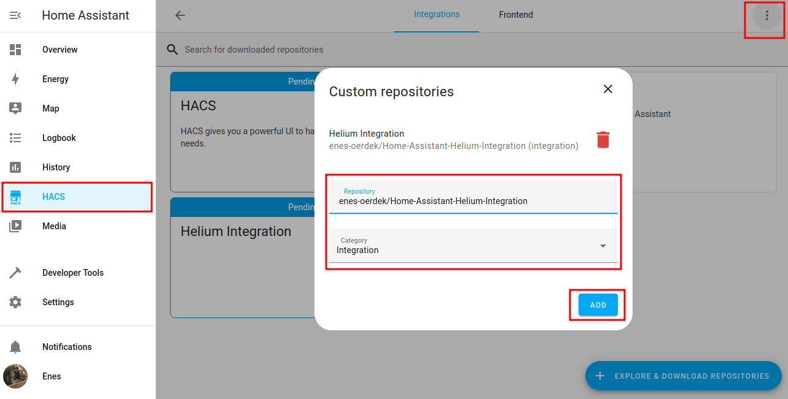
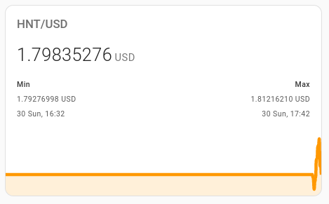
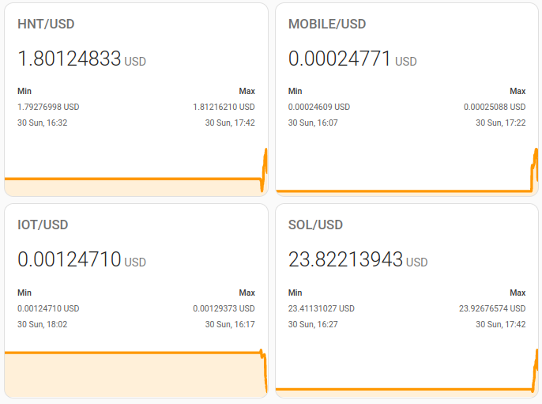

# Helium Integration for Home Assistant

## Introduction

Welcome to the future of Home Assistant integration with Helium! :tada: This project is designed to bring the power and versatility of Helium to your smart home, revolutionizing the way you interact with your connected devices. Inspired by [rsnodgrass' hass-helium](https://github.com/rsnodgrass/hass-helium) project, we've taken a fresh approach, building a comprehensive integration from the ground up to support the latest post-migration features of Helium. :rocket:

By embracing not only the HNT state but also the subDAOs IOT and MOBILE, the integration unlocks new possibilities for seamless connectivity across your smart home ecosystem. :bulb: Moreover, the solution incorporates the new staking system, ensuring that you stay ahead of the curve in the rapidly evolving world of decentralized networks. :globe_with_meridians:

Join us on this exciting journey as we redefine the way you interact with Home Assistant and Helium, and let's create a more connected and decentralized future together! :sparkles:

## Roadmap :rocket: 

- [x] **Price of HNT, IOT, and MOBILE** - Stay informed with real-time price updates for HNT, IOT, and MOBILE tokens, empowering you to make smarter decisions and optimize your smart home experience! :moneybag:
- [ ] **General Helium Stats** - Get a comprehensive overview of the Helium network with key performance metrics and insights, ensuring you always have your finger on the pulse of this dynamic ecosystem! :mag:
- [ ] **Wallet Stats** - Track your wallet balances and transactions with ease, helping you manage your assets and stay in control of your financial well-being! :chart_with_upwards_trend:
- [ ] **Hotspot Stats and Rewards** - Monitor your Helium hotspot performance, including detailed reward breakdowns, so you can maximize your earnings and contribute to a robust decentralized network! :satellite:
- [ ] **Staking Stats** - Stay up to date with your staking positions, providing you with valuable information to help you navigate the exciting world of Helium staking! :lock:
- [ ] **Staking Rewards** - Keep tabs on your staking rewards, enabling you to make the most of your investments and celebrate your wins in the Helium ecosystem! :tada:

## Installation :hammer_and_wrench:

Follow these simple steps to get started.

1. **Install the Home Assistant Community Store (HACS)** - Before you can use this integration, you'll need to have [HACS](https://github.com/hacs/integration) installed. Haven't set it up yet? No worries! Check out the [HACS installation guide](https://hacs.xyz/docs/installation/installation) to get up and running in no time.

2. **Add Custom Repository** - As our plugin is still maturing and not yet available in the HACS store, you'll need to install it as a custom repository. Don't worry; it's a breeze! Simply follow these steps:

    - Navigate to HACS in your Home Assistant instance
    - Select "Integrations"
    - Click the three dots in the top right corner and choose "Custom repositories"
    - In the "Add custom repository" dialog, enter the following information:
        - Repository: `enes-oerdek/Home-Assistant-Helium-Integration`
        - Category: `Integration`
    - Click "Add" and you're good to go!



Now you're all set to enjoy the benefits of Helium integration in your Home Assistant! :tada:


## Configuration :gear:

Get ready to unlock the full potential of Helium integration in your Home Assistant with this simple configuration! :star:

1. **Update your `configuration.yaml`** - Add the following code snippet to your `configuration.yaml` file:

```yaml
sensor:
  - platform: helium-solana-integration
```

This one-liner will introduce new sensors for the prices of HNT, IOT, MOBILE, and SOL, providing you with valuable insights right at your fingertips! :gem:

2. **Customize your dashboard** - Now that your sensors are set up, it's time to add them to your Home Assistant dashboard. Check out the examples below for inspiration and create a personalized display that suits your needs.

3. **Introduce Automations** - Stay ahead of the game by setting up automations to be notified of major price changes! :mega: Create an automation using the newly introduced price data, so you're always in the know when it comes to your investments.

Your Home Assistant is now supercharged with Helium integration, giving you unparalleled control and insights into your smart home ecosystem! :tada:
This will introduce new sensors with the prices of HNT, IOT, MOBILE and SOL. You can now add these sensors into your dashboard (see examples).

## Examples :rainbow:

Discover the amazing possibilities of Helium integration in your Home Assistant through these inspiring examples! :star:

### Price Monitoring :bar_chart:

Enhance your dashboard with sleek and informative price monitoring graphs using the [mini-graph-card](https://github.com/kalkih/mini-graph-card). Visualize price trends and make data-driven decisions with style!

**Preview:**



Or with multiple cards:



**Code:**

```yaml
animate: true
entities:
  - entity: sensor.price_hnt
graph: line
hour24: true
font_size: 75
hours_to_show: 72
points_per_hour: 12
name: HNT/USD
decimals: 8
show:
  extrema: true
  icon: false
  name: true
type: custom:mini-graph-card
```

## Contributing :handshake:

We warmly welcome contributions from the community! Whether you have a brilliant idea, a bug report, or simply want to lend a helping hand, your input is greatly appreciated. :star:

To get started, you can:

1. **Submit an issue** - Found a bug or have a feature request? Open a new issue on our GitHub repository and let us know.
2. **Create a pull request** - Have a fix or improvement you'd like to contribute? Fork the repo, make your changes, and submit a pull request for review.

Together, we can make this project even better! :muscle:


## Acknowledgements :raised_hands:

A big thank you to the following contributors for their invaluable resources and support that helped make this project possible:

1. [Aaron Godfrey](https://aarongodfrey.dev/home%20automation/building_a_home_assistant_custom_component_part_1/) - For providing a comprehensive guide on creating a HACS integration.

2. [lthiery](https://github.com/lthiery/hnt-explorer) - For providing the new hnt-explorer which makes consuming staking data easier.

3. [rsnodgrass' hass-helium](https://github.com/rsnodgrass/hass-helium) - Before creating a new integration, I used rsnodgrass' plugin. Unfortunately it does not seem to get updated. 

Stay tuned for more acknowledgements as our project evolves and grows! :rocket:
